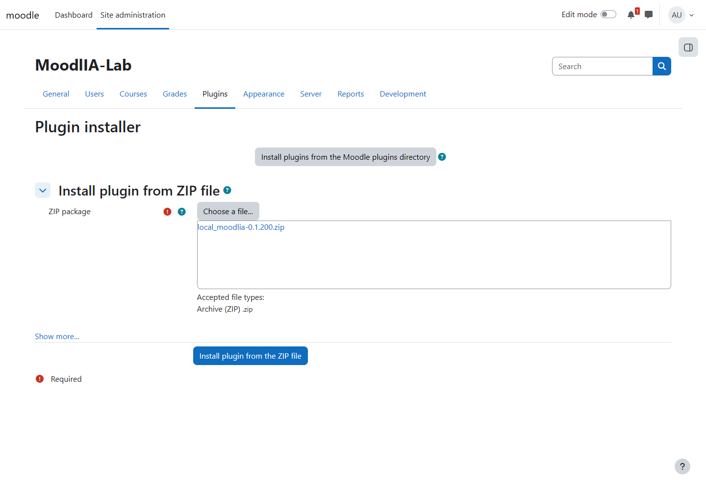
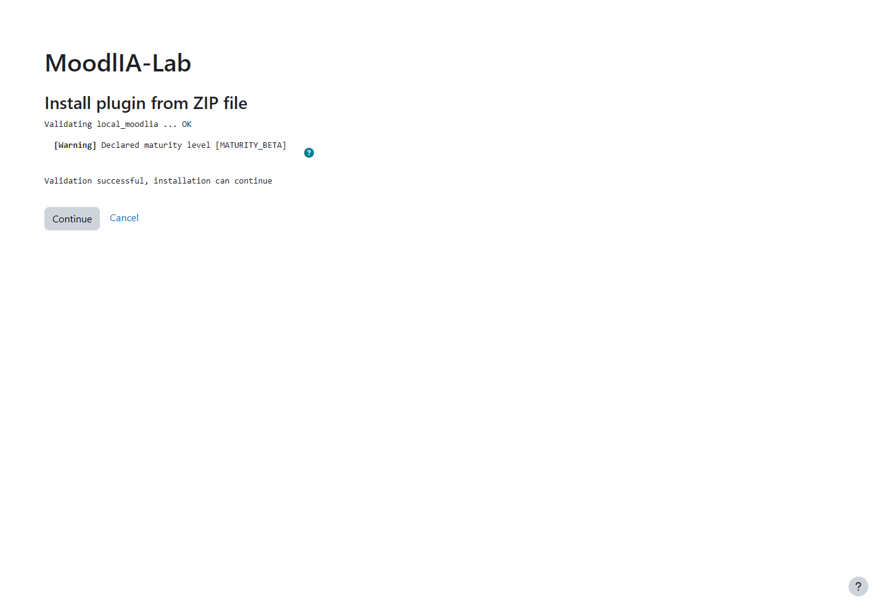
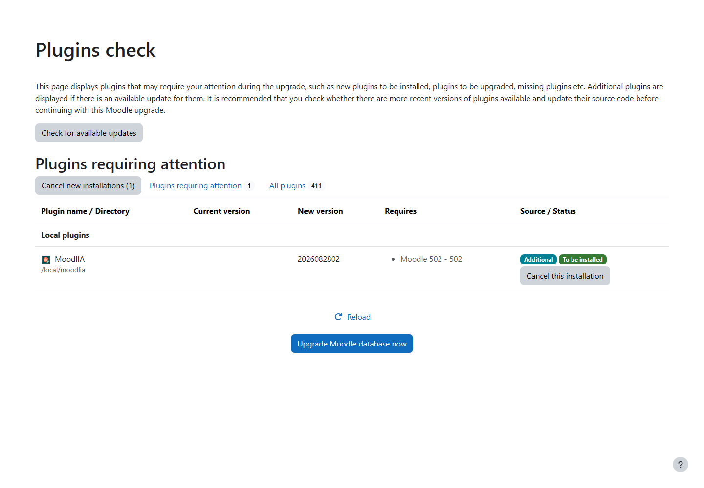
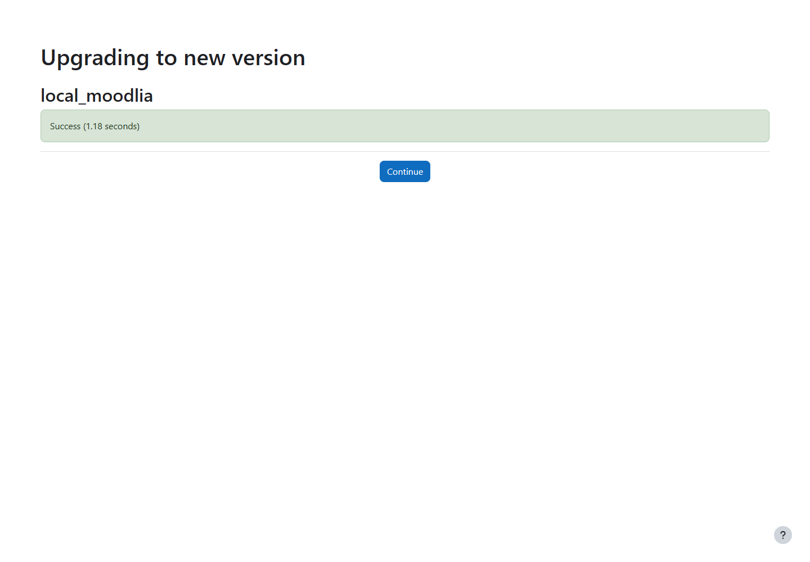
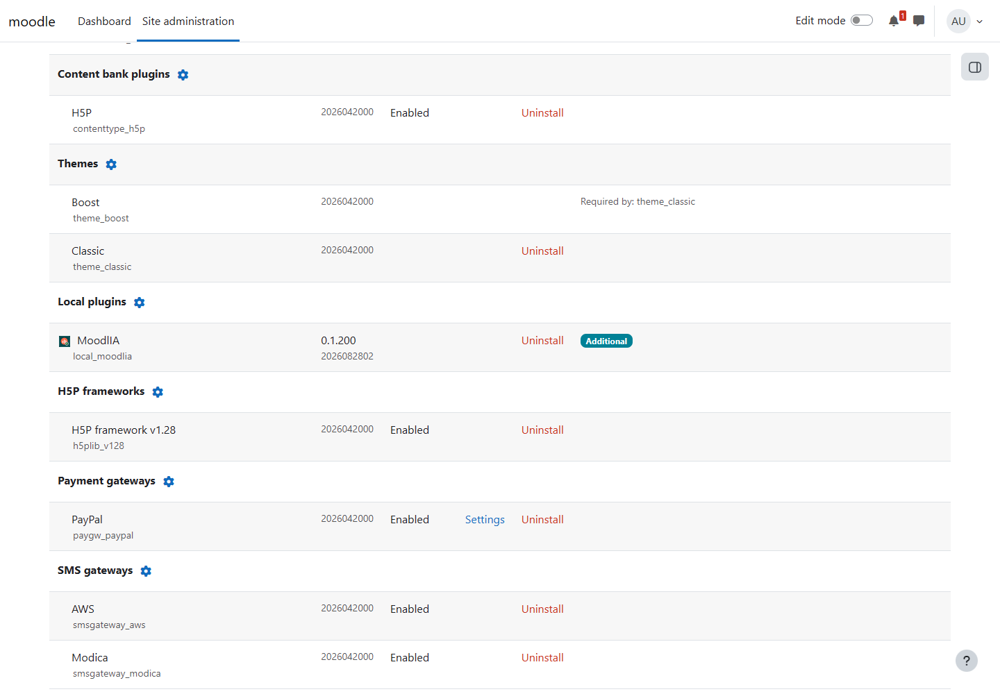

# Install MoodlIA Through Moodle's Web Interface

This guide covers a complete browser-based installation of the MoodlIA Moodle
plugin. It is intended for Moodle administrators who can install plugins from
ZIP files but do not necessarily have shell access to the server.

The procedure was verified end to end on 2 September 2026 with the following
clean environment:

| Component | Verified version |
| --- | --- |
| Moodle | 5.2.2 (Build: 20260810) |
| PHP | 8.3.15 |
| MariaDB | 11.4.12 |
| MoodlIA | 0.1.200 (`2026082802`) |

The screenshots show that validation run. Labels can differ slightly in other
Moodle themes or language packs.

## Before You Start

Confirm all of the following:

- The site runs Moodle 5.2. MoodlIA 0.1.200 supports Moodle 5.2 only.
- You are signed in as a site administrator.
- You have a current Moodle code, database, and `moodledata` backup.
- The web server can write to the Moodle code directory. If it cannot, use the
  [server deployment procedure](install-release-guide.md#deploy-to-a-standard-moodle-server).
- The PHP and web-server upload limits are larger than the plugin archive.
- You have the release archive named `local_moodlia-<release>.zip`.

For a production site, schedule the installation during a maintenance window.
The database upgrade is short because MoodlIA creates no plugin-owned database
tables, but Moodle can temporarily redirect users to the upgrade screen.

## Obtain the ZIP Package

Use the ZIP attached to the intended MoodlIA release. If you are installing a
checked-out development version, build the same archive locally:

```bash
npm ci
npm run plugin:archive
```

The generated file is stored under `empaquetado/`, for example:

```text
empaquetado/local_moodlia-0.1.200.zip
```

Do not upload a generic GitHub source-code ZIP. The installable archive must
contain one top-level `moodlia/` directory, and `moodlia/version.php` must
declare the component `local_moodlia`.

## Install the Plugin

1. Open **Site administration**.
2. Select **Plugins**, then **Install plugins**.
3. In **Install plugin from ZIP file**, select **Choose a file...**.
4. In Moodle's file picker, select **Upload a file**, choose the MoodlIA ZIP,
   and select **Upload this file**.
5. Confirm that the selected filename is `local_moodlia-<release>.zip`, then
   select **Install plugin from the ZIP file**.



Moodle extracts the archive and validates its component metadata. The result
must identify `local_moodlia` and end with **Validation successful,
installation can continue**.



The `MATURITY_BETA` message is informational for release 0.1.200. Stop if the
page reports any other warning or error, such as an unsupported Moodle version,
an invalid component name, or an unwritable destination directory.

6. Select **Continue**.
7. Review Moodle's server checks. Continue only when Moodle reports that the
   server environment meets all minimum requirements.
8. On **Plugins check**, confirm the following row before changing the
   database:

   - Plugin name: `MoodlIA`
   - Directory: `/local/moodlia`
   - New version: the version expected from the release
   - Required Moodle range: `502 - 502` for release 0.1.200
   - Status: **Additional** and **To be installed**



9. Select **Upgrade Moodle database now**.
10. Wait for the `local_moodlia` upgrade result. Do not reload the page while
    the upgrade is running.



11. Select **Continue** to return to Moodle administration.

## Verify the Installation

Open **Site administration → Plugins → Plugins overview** and locate **Local
plugins**. The MoodlIA row must show:

- Name: `MoodlIA`
- Component: `local_moodlia`
- Release: `0.1.200`, or the release you installed
- Version: `2026082802`, or the version declared by that release
- Source: **Additional**



The MCP endpoint is now present at:

```text
https://your-moodle.example/local/moodlia/mcp.php
```

An unauthenticated browser request is not a functional MCP test. The endpoint
requires the supported HTTP method, MCP headers, and a Moodle REST token
authorised for the MoodlIA service.

## Enable a User to Use MoodlIA

MoodlIA is an integration layer, not an activity that a user opens inside a
course. A user operates it through the `moodlia` CLI, a REST client, or an MCP
client. Every request runs as the Moodle user that owns the token and is
limited by that user's Moodle permissions.

Use a dedicated service user rather than a site administrator or a teacher's
personal account. This gives the integration its own audit identity and allows
its token to be revoked without affecting a human login.

### 1. Enable Moodle Web Services and REST

1. Open **Site administration → General → Advanced features**.
2. Enable **Web services** and save the page.
3. Open **Site administration → Server → Web services → Manage protocols**.
4. Enable **REST protocol**. Disable unused protocols.

The public CLI calls Moodle REST directly. The Moodle-hosted MCP endpoint uses
the same token and operation permissions.

### 2. Create a Dedicated User

Open **Site administration → Users → Accounts → Add a new user** and create an
account such as `moodlia-service` with:

- A strong, unique password.
- A real administrator-controlled email address.
- No site administrator status.
- No broad system role inherited from an unrelated human account.

The password is used only to manage the account. External clients authenticate
with the token created later.

### 3. Create the Minimum System Role

Open **Site administration → Users → Permissions → Define roles**, select **Add
a new role**, choose **No role** as the preset, and continue. Configure:

- Short name: `moodlia_service_user`
- Custom full name: `MoodlIA service user`
- Role archetype: **None**
- Context types where this role may be assigned: **System**

Allow these two capabilities:

| Capability | Why it is required |
| --- | --- |
| `webservice/rest:use` | Allows the user to call Moodle through the REST protocol used by the CLI. |
| `local/moodlia:useapi` | Opens the MoodlIA operation layer for the authenticated user. |

Do not allow `local/moodlia:manageplugins` by default. It is a separate
administrative capability for plugin inventory and guarded enabled-state
changes. Add it only to an account created specifically for that purpose.

If the service user must create its own tokens, also allow
`moodle/webservice:createtoken`. This is not required when an administrator
creates and manages the token, which is the recommended workflow.

Save the role, then open **Site administration → Users → Permissions → Assign
system roles**, select **MoodlIA service user**, and add the dedicated account.

### 4. Grant Only the Required Moodle Permissions

The system role above only permits transport and entry into MoodlIA. Every
operation also checks its normal Moodle capability. Prefer existing,
scope-limited Moodle roles:

- Enrol the account as a teacher only in courses it must manage.
- Assign category roles only when it must create or manage courses in that
  category.
- Add grade, question-bank, backup, or activity capabilities only when the
  intended workflow requires them.
- Avoid assigning Manager at system context merely to make an operation pass.

Examples:

| Intended operation | Additional access typically required |
| --- | --- |
| Read a course | Course visibility and `moodle/course:view` |
| Create or update activities | `moodle/course:manageactivities` in the target course |
| Manage question banks | The relevant `moodle/question:*` capabilities in the target context |
| Configure Workshop grading forms | `mod/workshop:editdimensions` in the target course |
| Back up a course | `moodle/backup:backupcourse` in the source course |
| Restore a course | `moodle/restore:restorecourse` in the destination course or category; source backup access may also be required |

The [canonical interface contract](interface-contract.md) and the plugin's web
service definitions are authoritative for the exact capability set of each
operation.

### 5. Authorise the User for MoodlIA Service

1. Open **Site administration → Server → Web services → External services**.
2. Locate **MoodlIA service** with short name `local_moodlia`.
3. Select **Authorised users**.
4. Select the dedicated account under **Not authorised users** and select
   **Add**.

MoodlIA service is intentionally restricted to explicitly authorised users.
Having the role capabilities alone is not enough.

### 6. Create and Protect the Token

1. Open **Site administration → Server → Web services → Manage tokens**.
2. Select **Create token**.
3. Enter a descriptive name such as `MoodlIA CLI - curriculum team`.
4. Select the dedicated user and **MoodlIA service**.
5. Set an expiry date. Add an IP restriction when the client has a stable
   address and the restriction is operationally safe.
6. Save the token and move it immediately into the client's secret store.

Never place a token in documentation, source control, screenshots, shell
history, issue reports, or chat messages. Create separate tokens for separate
clients so that one integration can be revoked independently.

### 7. Use the Plugin Through the CLI

Install the public client on the computer that will operate Moodle:

```bash
npm install -g moodlia
```

See [CLI Usage](cli-usage.md) for local installation, shell-specific
configuration, and the full command workflow.

Keep connection settings in environment variables or a protected `.env` file:

```text
MOODLE_BASE_URL=https://your-moodle.example
MOODLE_REST_TOKEN=replace-with-the-protected-token
```

Start with read-only checks:

```bash
moodlia get-current-user --format json
moodlia get-moodlia-status --format json
moodlia get-courses --limit 10 --format json
```

The returned current user must be the dedicated account, not the administrator
who created the token.

### 8. Use the Plugin Through MCP

Configure the MCP client with:

```text
Endpoint: https://your-moodle.example/local/moodlia/mcp.php
Authentication: Bearer token from MoodlIA service
```

Store the bearer token using the MCP client's secret mechanism. A compatible
client discovers the server, lists tools, and calls them using the same
operation names and permissions as the CLI and REST surfaces.

### 9. Diagnose Access Failures

Check access in this order:

1. The token is current and belongs to the expected user and service.
2. Moodle web services and REST are enabled.
3. The user is listed under **MoodlIA service → Authorised users**.
4. The system role allows `webservice/rest:use` and
   `local/moodlia:useapi`.
5. The user has the operation-specific capability in the target course,
   category, module, or system context.
6. The target object is visible to that user.

A successful `get-current-user` followed by a permission error on another
operation usually means authentication is working and only the
operation-specific Moodle capability or target context is missing.

## Common Problems

### The Install Plugins Page Is Unavailable

The site may disable web-based code deployment, or the web server may not be
allowed to write to the Moodle code directory. Install the `moodlia` directory
under `<moodle-root>/local/moodlia` and run Moodle's CLI upgrade instead.

### Moodle Rejects the ZIP Structure

Build the archive with `npm run plugin:archive`. A valid package has one
top-level `moodlia/` directory. Renaming a repository source archive is not
equivalent to building the plugin package.

### The Archive Exceeds the Upload Limit

Increase the applicable PHP and reverse-proxy limits, or use server deployment.
Check `upload_max_filesize`, `post_max_size`, and the fronting web server's body
size limit.

### Moodle Reports an Unsupported Version

Match the target Moodle release against `version.php`. MoodlIA 0.1.200 declares
`$plugin->supported = [502, 502]` and must not be installed on a different
Moodle series without a compatible plugin release.

### The Upgrade Was Interrupted

Return to `/admin/index.php` as an administrator and inspect the current state
before retrying. Do not upload the ZIP repeatedly after a timeout; the file
installation may already have completed.

## Updating an Existing Installation

Upload the newer `local_moodlia-<release>.zip` through the same page. Moodle
will identify the existing component and present it as an upgrade. Back up the
site first, verify both current and target versions on **Plugins check**, and do
not attempt an arbitrary downgrade through the web installer.
